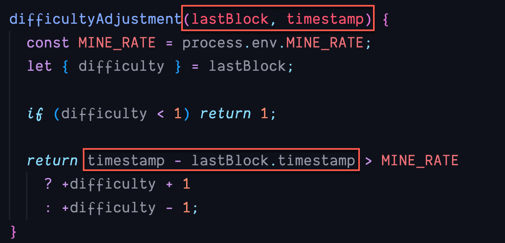
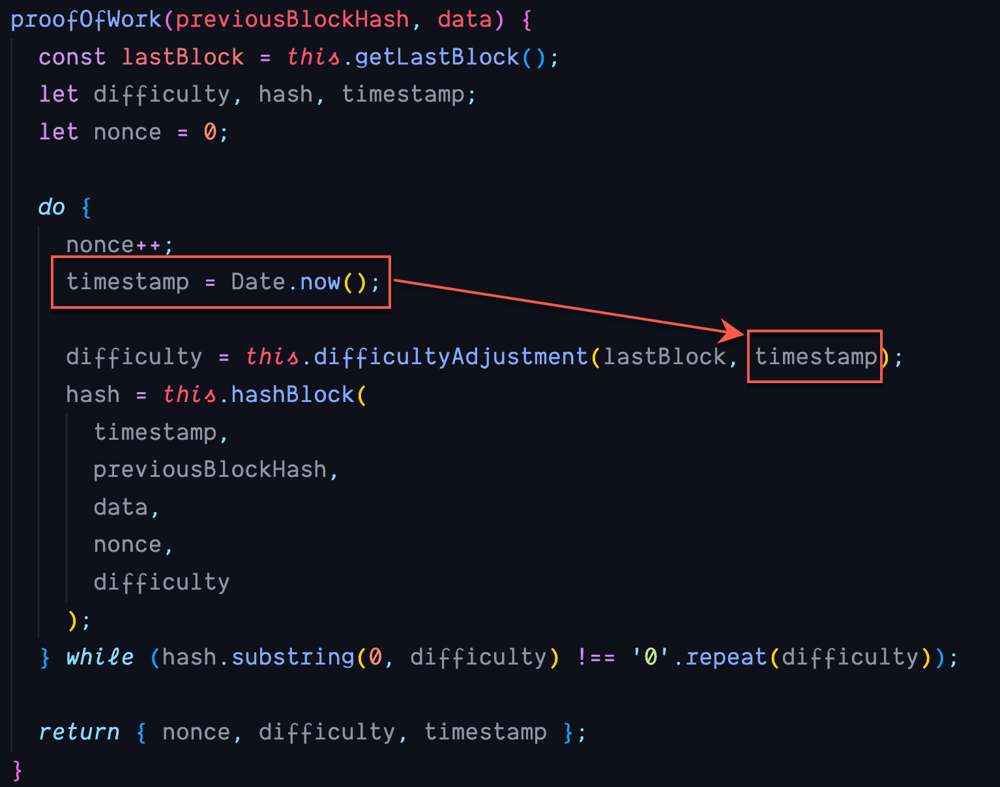

# Balansera svårighetsgraden av mining processen

Jag är mycket ledsen 😔 men min logik var inte helt rätt i min hjärna när vi gick igenom första omgången av _difficulty_ processen. Får skylla på att det var sent på eftermiddagen och att jag pratar samtidigt som jag skriver kod 😂.

HOPPAS ATT NI KAN HA ÖVERSEENDE MED DETTA OCH FÖRLÅTA MIG 🥹

Sedan precis som Adam, Rasmus och Rowel var inne på så SKA de prefixande nollorna vara med i den framräknade hashen. Vi får ju tillbaka en värde som indikerar hur många iterationer som görs för att få fram den korrekta hashen.
Den skickar vi in när vi skapar hash värdet för vårt block och det ska då ge oss exakt samma hash som iterationen gav oss.

Mitt fel igen vilket är ett följdfel på min härdsmälta och tidigare fel som jag skapat i koden😱.

#### Här kommer en uppdaterad version av projektet.

Det som framförallt blev fel var att jag missade att ta med aktuellt _timestamp_ i argumentlistan till metoden **difficultyAdjustment**.

Dessutom så plockade jag fel _timestamp_ när jag _destructured_ lastBlock. Det ledde till att jag vände på matematiken när _MINE_RATE_ skulle användas.

Se bild nedan

Sedan i anropet i **proofOfWork** skapas en aktuell _timestamp_ som skickas med till **difficultyAdjustment** metoden.

Förhoppningsvis ska detta göra det hela lite mer förståeligt.
